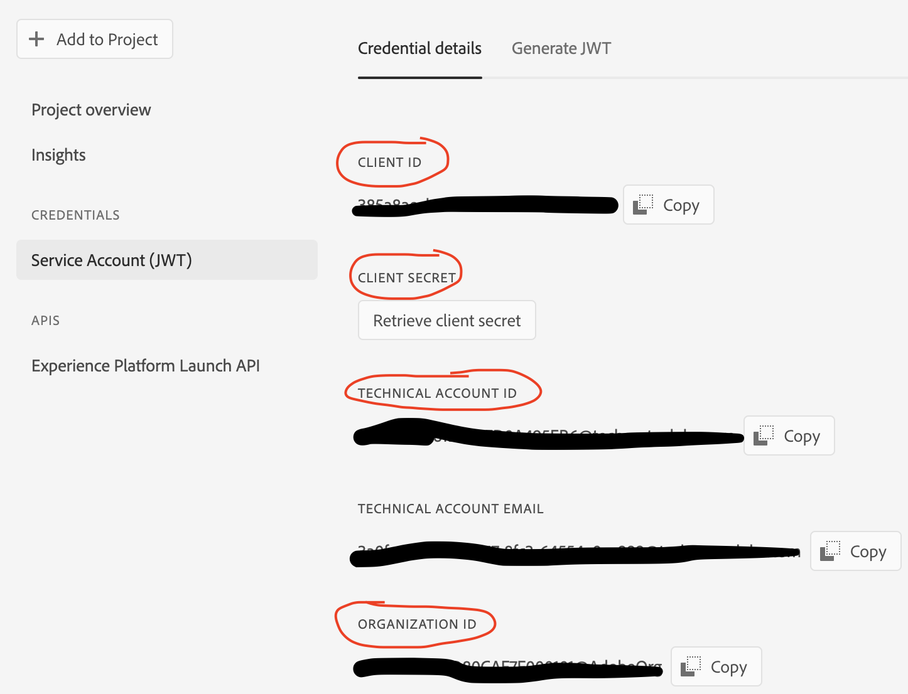

# Create a Postman Environment file
In order to use the Reactor API (AEP Tags), you need to authenticate through Adobe IO using Adobe IMS. This will require creating an Adobe IO project, adding the launch API to the project, and then setting the appropriate Launch profile for permissions. Once these steps are completed, you can copy the required  values into your postman environment file to use the Reactor API.

<!-- START doctoc generated TOC please keep comment here to allow auto update -->
<!-- DON'T EDIT THIS SECTION, INSTEAD RE-RUN doctoc TO UPDATE -->

- [Create a Postman Environment file](#create-a-postman-environment-file)
  - [Create an IO project](#create-an-io-project)
  - [Create the postman environment JSON](#create-the-postman-environment-json)
    - [Create the JSON](#create-the-json)
    - [Add IMS values to the JSON](#add-ims-values-to-the-json)

<!-- END doctoc generated TOC please keep comment here to allow auto update -->

## Create an IO project
 1. Go to https://console.adobe.io/home
 2. Create a new project. Name the project unique to this connection so that it's easy to understand what it's used for.
 3. Click **Add to Project > API**
 4. Under Adobe Experience Platform, select **Experience Platform Launch API** and **Next**
 5. Select Option 1 **Generate a key pair**
 5. Generate the keypair and download. This will download both a private.key file and certificate_pub.crt file.
 6. **Next**
 7. Select the appropriate Launch profile that will give full access to Launch. If you don't have a launch product profile setup, you can learn how to set one up here: https://experienceleague.adobe.com/docs/platform-learn/data-collection/tags/users-and-permissions.html?lang=en
 7. **Finish**

## Create the postman environment JSON

### Create the JSON

 1. Copy the [docs/examples/example.postman_environment.json](docs/examples/example.postman_environment.json) file in this folder.
 2. Rename it so it's unique to the org you're connecting to.

### Add IMS values to the JSON

The steps below represent the minimum number of values needed to interact with the Launch API.

  1. In your Adobe IO project, go to the **Credentials > Service Account (JWT)**, copy the following values into their respective values in the environment JSON:
        1. **CLIENT_ID** (Client ID)
        2. **CLIENT_SECRET** (Client Secret)
        3. **TECHNICAL_ACCOUNT** (Technical Account ID)
        4. **ORG_ID** (Organization ID)
        
        
        
  2. Next, open the private.key file you downloaded earlier in a text editor. Copy the entire text.
        1. In the environment JSON paste the private key value into the **PRIVATE_KEY** field. 
  3. **Save** 