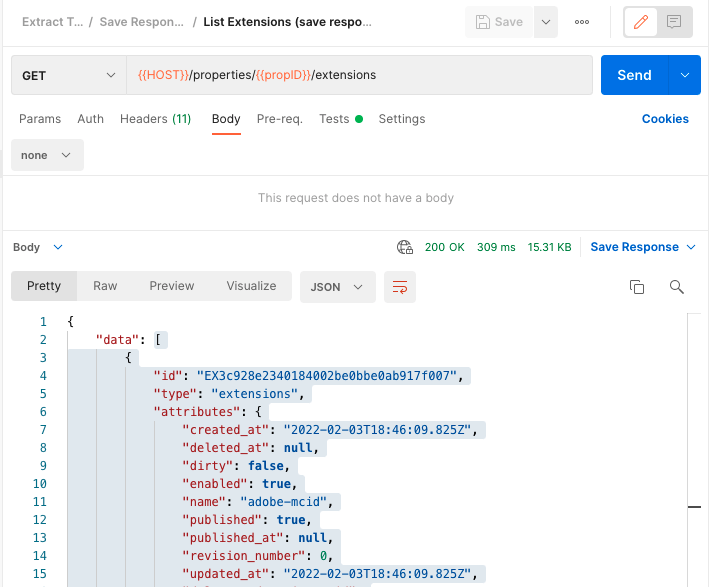
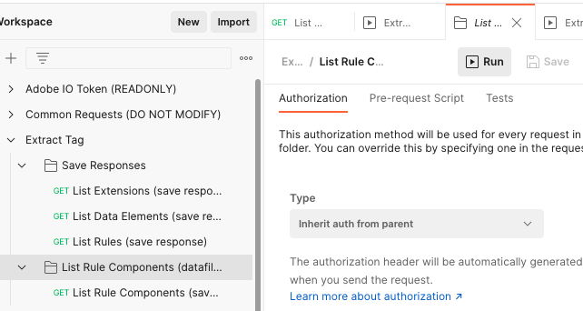

# Export a Tag

Prerequisites:

* Postman_environment.json file is configured and imported into postman

> **IMPORTANT!!** When you export custom code from extensions, data elements, and rules there is a chance you might need to escape certain characters again to make valid JSON files. Make sure you validate your JSON files after you copy the responses!
>
> Example:
>
> ```json
> "settings":"{\"source\":\"if(event \&\& event.id) {\\n    return event.id;\\n}\"}"
> ```
>
> Should be updated to:
>
> ```json
> "settings":"{\"source\":\"if(event \\&\\& event.id) {\\n    return event.id;\\n}\"}"
> ```
>
> 

## Export Process

1. In Postman, set your environment to the organization with the Tag property that needs exported
2. Run the collection `Adobe IO Token` to authenticate to your organization
3. Select the `Export Tag` collection folder > Variables and add a property
   1. `propID` = property ID you would like to export
   2. Save
4. Select the `Extensions and Data Elements > List Extensions` request and click **Run**
5. Copy the `data` value (everything in [ ]) of the resposnse and save it into a new file: **myProject-extensions.json**



6. Repeat the previous step for the `List Data Elements` request and add the response to **myProject-data-elements.json**
7. To export all of the rule components associated with each rule, you will need to run a Collection Runner on the `Rule Components` folder:
   1. Select the `Rule Components` folder and click **Run**




   2. In the collection run settings:

         1. Check **Save responses**
         2. **Run Export Tag**

      

10. Once all of the requests have completed, select each `List Rule Components` request name > `Response Body`


11. Copy the `data` value (everything in [ ]) of the resposnse and save it into a new file: **myProject-rulecmps-nameOfRule.json**
12. Repeat the previous 2 steps for all requests from the collection run. 
13. Once all steps above have been completed you should now have a series of json files:
    1. **myProject-extensions.json**
    2. **myProject-data-elements.json**
    4. **myProject-rulecmps-nameOfRule1.json**
    5. **myProject-rulecmps-nameOfRule2.json**
    6. **...**