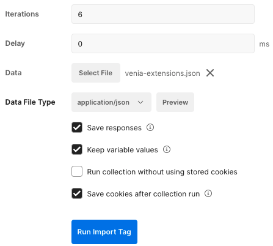

# Import a Tag using Postman

<!-- START doctoc generated TOC please keep comment here to allow auto update -->
<!-- DON'T EDIT THIS SECTION, INSTEAD RE-RUN doctoc TO UPDATE -->

  - [Prerequisites](#prerequisites)
  - [Importing to a different Adobe Organization](#importing-to-a-different-adobe-organization)
- [Import a Tag using Postman](#import-a-tag-using-postman)
    - [Prerequisites](#prerequisites)
    - [Importing to a different Adobe Organization](#importing-to-a-different-adobe-organization)
  - [Import process](#import-process)
    - [Create the initial property](#create-the-initial-property)
    - [Add Extensions to the property](#add-extensions-to-the-property)
    - [Add Data Elements to the property](#add-data-elements-to-the-property)
    - [Add rules with rule components to the property](#add-rules-with-rule-components-to-the-property)
    - [Publish the property to production](#publish-the-property-to-production)

<!-- END doctoc generated TOC please keep comment here to allow auto update -->

### Prerequisites

* [postman_environment.json](environment.md) file is configured to your Adobe Organization
* [Import](https://testfully.io/blog/import-from-postman/#import-postman-environments) your postman_environment.json
* Import [Adobe IO Token](../collections/Adobe%20IO%20Token.postman_collection.json) collection to Postman
* Import [Import Tag Property](../collections/Import%20Tag%20Property.postman_collection.json) collection to Postman

### Importing to a different Adobe Organization
If you are trying to import a tag property into a different organization than what it was exported from, there will be unique values that need to be updated. This can be done 2 different ways:
 1. Create a [postman_globals.json](globals.md) and add the unique settings as key value pairs
    1. Import the postman_globals.json file into Postman
 2. Manually update the unique values after import

## Import process

1. In Postman, select your environment that you imported
2. Run the collection `Adobe IO Token` to authenticate to your organization

### Create the initial property

1. Select the `Import Tag property > Create Tag Property` folder
   1. Set a variable: `propName` = My Property Title
2. Select the `Create Tag Property` folder > **Run**
   1. Click **Run**. This created the initial Tag property

### Add Extensions to the property

1. Select the `Import Tag property > Add Tag Extensions` folder > **Run**
   1. Data: select the **myProject-extensions.json** as the datafile
   2. Check **Save responses**
   3. Click **Run**

   

### Add Data Elements to the property

1. Select the `Import Tag property > Add Tag Data Elements` folder > **Run**
   1. Data: select the **myProject-data-elements.json** as the datafile
   2. Check **Save responses**
   3. **Run Import Tag**

   

### Add rules with rule components to the property

Rules and rule IDs are completely independent of the rule components and their IDs. Because of this, it's easiest to set the name of the rule as a variable and then import the rule components to the new rule ID created.

1. Select the `Import Tag property > Add Tag rule and cmps` 
   1. Set a variable: `ruleName` = name of Rule 1
2. Select the `Add Tag rule and cmps` folder > **Run**
   1. Data: select the **myProject-rulecmps-nameOfRule1.json** as the datafile
   2. Check **Save responses**
   3. **Run Import Tag**
3. Repeat previous steps for all **myProject-rulecmp.json** files

### Publish the property to production

1. To publish your tag property to production:
   1. Select the `Import Tag property > Publish Tag Library` folder > **Run**
   2. Click **Run**.
2. You should now have a fully imported Tag property that is published to production ready to use.