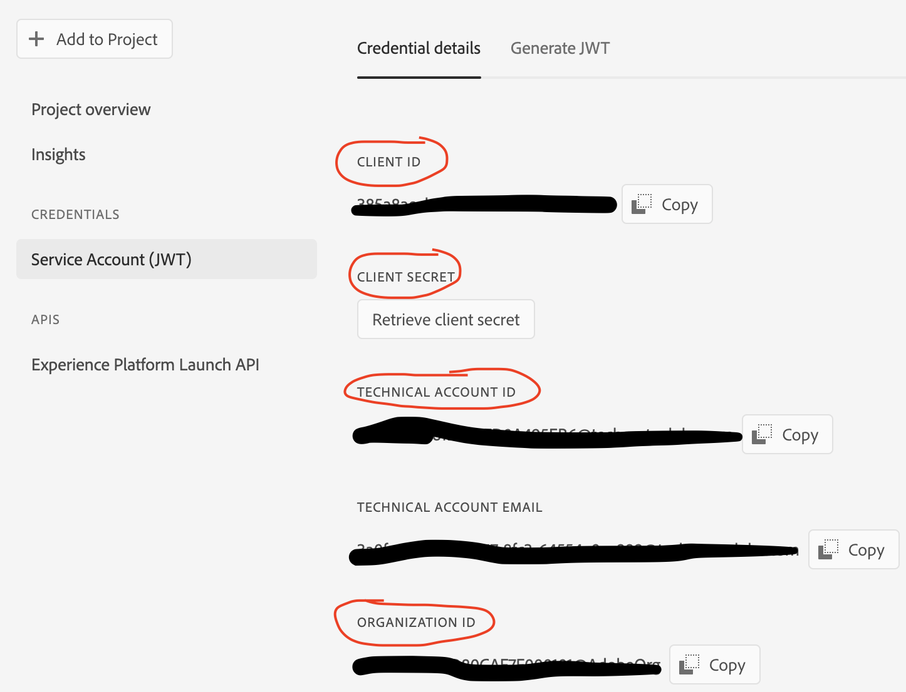

# Create a Postman Environment file
In order to use the Tag API, you need to authenticate through Adobe IO using Adobe IMS. This will require creating an Adobe IO project, adding the launch API to the project, and then setting the appropriate Launch profile for permissions. Once these steps are completed, you can copy the required  values into your postman environment file to use the Launch API.

<!-- START doctoc generated TOC please keep comment here to allow auto update -->
<!-- DON'T EDIT THIS SECTION, INSTEAD RE-RUN doctoc TO UPDATE -->
**Contents**

- [Create an IO project](#create-an-io-project)
- [Create the postman environment JSON](#create-the-postman-environment-json)
  - [Create the JSON](#create-the-json)
  - [Add IMS values to the JSON](#add-ims-values-to-the-json)
  - [Add unique values specific to this project](#add-unique-values-specific-to-this-project)
- [Upload the environment JSON to Postman](#upload-the-environment-json-to-postman)

<!-- END doctoc generated TOC please keep comment here to allow auto update -->


## Create an IO project
 1. Go to https://console.adobe.io/home
 2. Create a new project. Name the project unique to this connection so that it's easy to understand what it's used for.
 3. Click **Add to Project > API**
 4. Under Adobe Experience Platform, select **Experience Platform Launch API** and **Next**
 5. Select Option 1 **Generate a key pair**
 5. Generate the keypair and download. This will download both a private.key file and certificate_pub.crt file.
 6. **Next**
 7. Select the appropriate Launch profile that will give full access to Launch. If you don't have a launch product profile setup, you can learn how to set one up here: https://experienceleague.adobe.com/docs/platform-learn/data-collection/tags/users-and-permissions.html?lang=en
 7. **Finish**

## Create the postman environment JSON
### Create the JSON

 1. Copy the [example.postman_environment.json](example.postman_environment.json) file in this folder.
 2. Rename it so it's unique to you.

### Add IMS values to the JSON

The steps below represent the minimum number of values needed to interact with the Launch API.

  1. In your Adobe IO project, go to the **Credentials > Service Account (JWT)**, copy the following values into their respective values in the environment JSON:
        1. **CLIENT_ID** (Client ID)
        2. **CLIENT_SECRET** (Client Secret)
        3. **TECHNICAL_ACCOUNT** (Technical Account ID)
        4. **ORG_ID** (Organization ID)
        
        
        
  2. Next, open the private.key file you downloaded earlier in a text editor. Copy the entire text.
        1. In the environment JSON paste the private key value into the **PRIVATE_KEY** field.
        
  3. **Save**

### Add unique configuration values for Extensions

Tag Extensions typically have unique values specific to the Adobe Organization you are using. To mitigate this uniquiness, you can add the custom settings as a JSON in the postman_environment.json file. The easiest way to get these values is to extract them from the export process and edit the unique values. To successfully add them to the postman_environment.json, you need to use a special naming convention: `SETTINGS-<ExtentionName>`. You can find the ExtensionName in nearly any GET request from Launch. In the request below you can see in `data[0].attributes.delegate_descripter_id` the ExtensionName is `adobe-mcid`

``` json
{
  "data": [
    {
      "id": "EX3c928e2340184002be0bbe0ab917f007",
      "type": "extensions",
      "attributes": {
        "created_at": "2022-02-03T18:46:09.825Z",
        "deleted_at": null,
        "dirty": false,
        "enabled": true,
        "name": "adobe-mcid",
        "published": true,
        "published_at": null,
        "revision_number": 0,
        "updated_at": "2022-02-03T18:46:09.825Z",
        "delegate_descriptor_id": "adobe-mcid::extensionConfiguration::config",
        "display_name": "Experience Cloud ID Service",
        "review_status": "unsubmitted",
        "version": "5.3.1",
        "settings": "{\"orgId\":\"myorgID@AdobeOrg\"}"
      },
      ...
      ]
    }
```

#### Experience Cloud ID Extension

Using the example output above, you can update the postman_environments.json file with the adobe-mcid extension settings by creating a new json entry. If you want to learn more about these values, you can look in the [ECID Extension](https://exchange.adobe.com/experiencecloud.details.104231.html) documentation.

myEnv.postman_environment.json

* `orgId` is your organization ID

```json
{
  "key": "SETTINGS_adobe-mcid",
  "value": {
    "orgId": "myorgID@AdobeOrg"
  },
  "enabled": true
},
```

#### Target Extension

The Target extension also has unique values that need configured. If you want to learn more about these values, you can look in the [Target v2 Extension](https://exchange.adobe.com/experiencecloud.details.102722.adobe-target-v2-launch-extension.html) documentation.

* `clientCode` can be found in Adobe Target UI, go to **Administration > Implementation**
* `imsOrgId` is your organization ID
* `serverDomain` is your server donmain

```json
{
  "key": "SETTINGS_adobe-target-v2",
  "value": {
    "targetSettings": {
      "clientCode": "myclientCode",
      "imsOrgId": "myorgID@AdobeOrg",
      "serverDomain": "myclientCode.tt.omtrdc.net",
      "enabled": true,
      "timeout": 3000,
      "version": "2.7.0",
      "endpoint": "/rest/v1/delivery",
      "secureOnly": false,
      "serverState": {},
      "optinEnabled": false,
      "urlSizeLimit": 2048,
      "viewsEnabled": true,
      "optoutEnabled": false,
      "globalMboxName": "target-global-mbox",
      "bodyHiddenStyle": "body {opacity: 0}",
      "pageLoadEnabled": true,
      "analyticsLogging": "server_side",
      "deviceIdLifetime": 63244800000,
      "bodyHidingEnabled": true,
      "decisioningMethod": "server-side",
      "sessionIdLifetime": 1860000,
      "visitorApiTimeout": 2000,
      "authoringScriptUrl": "//cdn.tt.omtrdc.net/cdn/target-vec.js",
      "overrideMboxEdgeServer": false,
      "selectorsPollingTimeout": 5000,
      "defaultContentHiddenStyle": "visibility: hidden;",
      "defaultContentVisibleStyle": "visibility: visible;",
      "overrideMboxEdgeServerTimeout": 1860000,
      "supplementalDataIdParamTimeout": 30
    }
  },
  "enabled": true
},
```


#### Analytics Extension

The Analytics extension also has unique  values that need configured. If you want to learn more about these values, you can look in the [Analytics Extension](https://experienceleague.adobe.com/docs/experience-platform/tags/extensions/adobe/analytics/overview.html?lang=en) documentation.

* `orgId` if your organization ID
* `libraryCode.company` is your Analytics company value
* `libraryCode.accounts.[development | production | staging]` are the different report suites configured
* `trackerProperties.[trackingServer | trackingServerSecure]` are the different tracking servers used for your Analytics

```json
{
  "key": "SETTINGS_adobe-analytics",
  "value": {
    "orgId": "myOrgID@AdobeOrg",
    "libraryCode": {
      "type": "managed",
      "company": "adobev12",
      "accounts": {
        "development": [
          "vlab7dev"
        ],
        "production": [
          "vlab7prod"
        ],
        "staging": [
          "vlab7stage"
        ]
      }
    },
    "trackerProperties": {
      "trackingServer": "acs7-us.sc.omtrdc.net",
      "trackingServerSecure": "acs7-us.sc.omtrdc.net"
    }
  },
  "enabled": true
}
```

## Upload the environment JSON to Postman
https://testfully.io/blog/import-from-postman/#import-postman-environments 