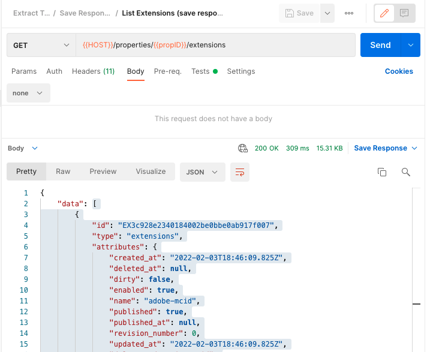
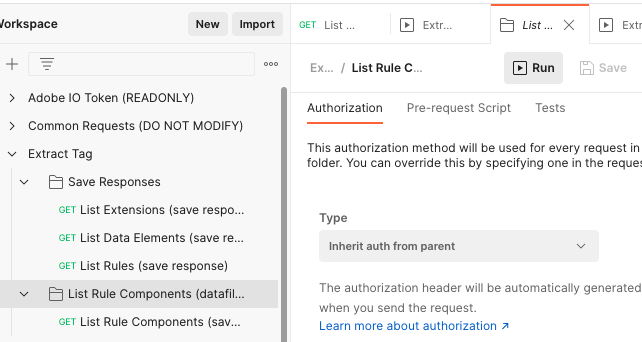
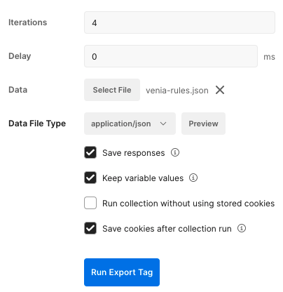
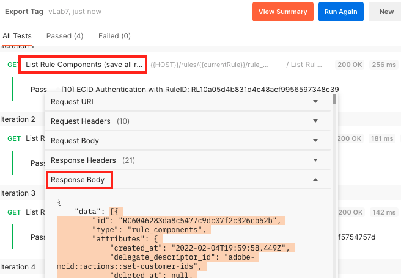

# Export a Tag

Prerequisites:

* Postman_environment.json file is configured and imported into postman
* All collections in this project are imported into postman

## Export Process

1. In Postman, set your environment to the organization with the Tag property that needs exported
2. Run the collection `Adobe IO Token` to authenticate to your organization
3. Select the `Export Tag` collection folder > Variables and add a property
   1. `propID` = property ID you would like to export
   2. Save
4. Select the `Save Responses > List Extensions` request and click **Run**
5. Copy the `data` value (everything in [ ]) of the resposnse and save it into a new file: **myProject-extensions.json**

6. Repeat the previous step for the rest of the `Save Responses` folder
   1. Save `List Data Elements` response to **myProject-data-elements.json**
   2. Save `List Rules` response to **myProject-rules.json**
7. To export all of the rule components associated with a rule, you  will need to use **myProject-rules.json**
8. Select the `List Rule` folder and click **Run**

9. In the collection run settings:
   1. Data: select the **myProject-rules.json** as the datafile
   2. Check **Save responses**
   3. **Run Export Tag**

10. Once all of the requests have completed, select each request name > `Response Body`

11. Copy the `data` value (everything in [ ]) of the resposnse and save it into a new file: **myProject-rulecmps-nameOfRule.json**
12. Repeat the previous 2 steps for all requests from the collection run. 
13. Once all steps above have been completed you should now have a series of json files:
    1. **myProject-extensions.json**
    2. **myProject-data-elements.json**
    3. **myProject-rules.json**
    4. **myProject-rulecmps-nameOfRule1.json**
    5. **myProject-rulecmps-nameOfRule2.json**
    6. **...**