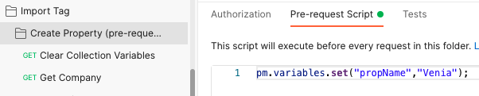
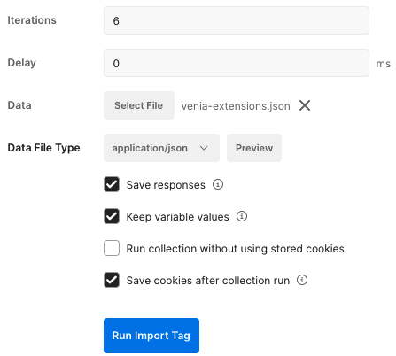
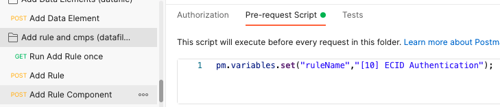

# Import a Tag using Postman UI

Prerequisites:

* Postman_environment.json file is configured and imported into postman
* You are using the latest Import Tag collection (See README.md)

## Import process

1. In Postman, set your environment to the organization that needs the Tag property imported
2. Run the collection `Adobe IO Token` to authenticate to your organization

### Create the initial property

1. Select the `Create Property` folder > `Pre-request scripts` tab

   1. Update the `propName` variable to your desired Tag property name
   2. Save

   

2. Select the `Create Property` folder > **Run**

3. Click **Run Import Tag**. This created the initial Tag property

### Add Extensions to the property

1. Select the `Add Extensions` folder > **Run**

2. In the collection run settings:

   1. Data: select the **myProject-extensions.json** as the datafile
   2. Check **Save responses**
   3. **Run Import Tag**

   > Warning: if you didn't set the SETTINGS environment variables correctly, this collection runner has a chance of failing. You can quickly see what's wrong with your settings by checking the response of each request

   

### Add Data Elements to the property

1. Select the `Add Data Elements` folder > **Run**

2. In the collection run settings:

   1. Data: select the **myProject-data-elements.json** as the datafile
   2. Check **Save responses**
   3. **Run Import Tag**

   

### Add rules with rule component to the property

Rules and rule IDs are completely independent of the rule components and their IDs. Because of this, it's easiest to set the name of the rule as a variable and then import the rule components to the new rule ID created.

1. Select the `Add rule and cmps` folder > `Pre-request scripts` tab

   1. Update the `ruleName` variable the desired name that matches **myProject-rulecmps-nameOfRule1.json**
   2. Save

   

2. Select the `Add rule and cmps` folder > **Run**

3. In the collection run settings:

   1. Data: select the **myProject-rulecmps-nameOfRule1.json** as the datafile
   2. Check **Save responses**
   3. **Run Import Tag**

4. Repeat the last 3 steps for all **myProject-rulecmp.json** files

### Publish the property to production

1. To publish your tag property to production:
   1. Select the `Publish Library` folder > **Run**
   2. Click **Run Import Tag**.
2. You should now have a fully imported Tag property that is published to production ready to use.